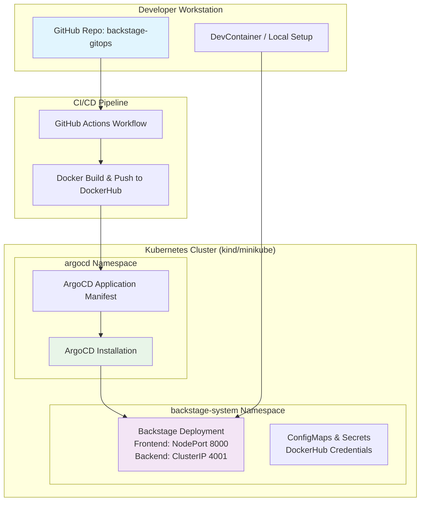

# Backstage GitOps on Kubernetes with ArgoCD

Este proyecto implementa un entorno completamente automatizado de Backstage desplegado en un clúster Kubernetes gestionado por ArgoCD, con CI/CD basado en GitHub Actions y DockerHub como registro de imágenes.

## Arquitectura General



## Componentes

### Infraestructura
- **Cluster Kubernetes**: kind o minikube (Kubernetes in Docker)
- **Namespace**: backstage-system
- **ArgoCD**: Instalado en namespace `argocd`
- **Backstage**: Desplegado con Helm chart

### Puertos
- **8000**: Backstage frontend (NodePort)
- **4001**: Backstage backend (ClusterIP)

### Servicios
- **Frontend**: Interfaz de usuario de Backstage
- **Backend**: API y lógica de negocio
- **Base de datos**: SQLite en memoria (desarrollo)

## Estructura del Repositorio

```
backstage-gitops/
├── backstage/                 # Código fuente de Backstage
│   ├── packages/
│   ├── app-config.yaml
│   └── Dockerfile
├── charts/                    # Helm charts
│   └── backstage/
│       ├── Chart.yaml
│       ├── values.yaml
│       └── templates/
├── infra/                     # Infraestructura como código
│   ├── kind/
│   │   └── kind-config.yaml
│   └── argocd/
│       ├── install.yaml
│       └── backstage-application.yaml
├── docs/                      # Documentación
├── .github/
│   └── workflows/
│       └── ci-cd.yaml
├── .devcontainer/             # DevContainer configuration
├── bootstrap.sh               # Script de inicialización
└── kind-setup.sh             # Script de configuración de kind
```

## Variables de Entorno

| Variable | Descripción | Valor por defecto |
|----------|-------------|-------------------|
| `BACKSTAGE_BASE_URL` | URL base del frontend | `http://localhost:8000` |
| `BACKSTAGE_BACKEND_URL` | URL base del backend | `http://localhost:4001` |
| `GITHUB_TOKEN` | Token de GitHub para integraciones | - |
| `DOCKERHUB_USERNAME` | Usuario de DockerHub | - |
| `DOCKERHUB_PASSWORD` | Contraseña de DockerHub | - |

## Flujo de Despliegue GitOps

1. **Desarrollo**: Cambios en el código de Backstage
2. **Commit**: Push a rama `main`
3. **CI/CD**: GitHub Actions construye y publica imagen Docker
4. **GitOps**: ArgoCD detecta cambios y sincroniza el clúster
5. **Despliegue**: Backstage se actualiza automáticamente

### Triggers Automáticos
- Push a `main`: Construcción y despliegue automático
- Pull Request: Validación de build
- Release: Versionado de imágenes

## Guía de Inicio Rápido

### Prerrequisitos
- Docker
- kubectl
- kind
- helm
- yarn

### Configuración Inicial

1. **Clonar el repositorio**
   ```bash
   git clone https://github.com/your-org/backstage-gitops.git
   cd backstage-gitops
   ```

2. **Configurar credenciales**
   ```bash
   # Crear secrets para DockerHub y GitHub
   kubectl create secret generic backstage-secrets \
     --from-literal=github-token=YOUR_GITHUB_TOKEN \
     --from-literal=dockerhub-username=YOUR_DOCKERHUB_USERNAME \
     --from-literal=dockerhub-password=YOUR_DOCKERHUB_PASSWORD \
     -n backstage-system
   ```

3. **Levantar el clúster**
   ```bash
   # Para kind:
   ./kind-setup.sh

   # Para minikube:
   ./infra/minikube/setup.sh
   ```

4. **Instalar ArgoCD**
   ```bash
   kubectl apply -f infra/argocd/install.yaml
   ```

5. **Desplegar Backstage**
   ```bash
   kubectl apply -f infra/argocd/backstage-application.yaml
   ```

6. **Acceder a Backstage**
   - Frontend: http://localhost:8000
   - ArgoCD UI: http://localhost:8080

## Desarrollo Local

### Con DevContainer
1. Abrir en VS Code con Dev Containers
2. El entorno se configura automáticamente

### Sin DevContainer
```bash
cd backstage
yarn install
yarn start
```

## Troubleshooting

### ArgoCD no sincroniza
```bash
# Verificar estado de la aplicación
kubectl get applications -n argocd

# Forzar sincronización
kubectl patch application backstage -n argocd --type merge -p '{"operation":{"sync":{"revision":"HEAD"}}}'
```

### Backstage no inicia
```bash
# Verificar logs
kubectl logs -n backstage-system deployment/backstage

# Verificar configuración
kubectl get configmap -n backstage-system
```

### Problemas de red
```bash
# Verificar servicios
kubectl get services -n backstage-system

# Verificar pods
kubectl get pods -n backstage-system
```

## Comandos Útiles

```bash
# Gestión del clúster
kind create cluster --config infra/kind/kind-config.yaml
kind delete cluster

# Gestión de ArgoCD
kubectl port-forward svc/argocd-server -n argocd 8080:443
kubectl get applications -n argocd

# Gestión de Backstage
kubectl get pods -n backstage-system
kubectl logs -n backstage-system deployment/backstage
kubectl port-forward svc/backstage -n backstage-system 8000:8000

# Debugging
kubectl describe pod <pod-name> -n backstage-system
kubectl get events -n backstage-system --sort-by=.metadata.creationTimestamp
```

## Contribución

1. Fork el proyecto
2. Crear rama feature (`git checkout -b feature/AmazingFeature`)
3. Commit cambios (`git commit -m 'Add some AmazingFeature'`)
4. Push a la rama (`git push origin feature/AmazingFeature`)
5. Abrir Pull Request

## Licencia

Este proyecto está bajo la Licencia MIT - ver el archivo [LICENSE](LICENSE) para más detalles.# Workflow trigger test
